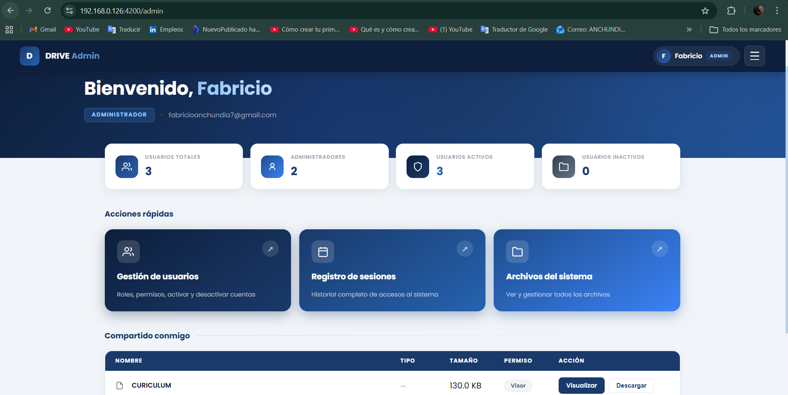
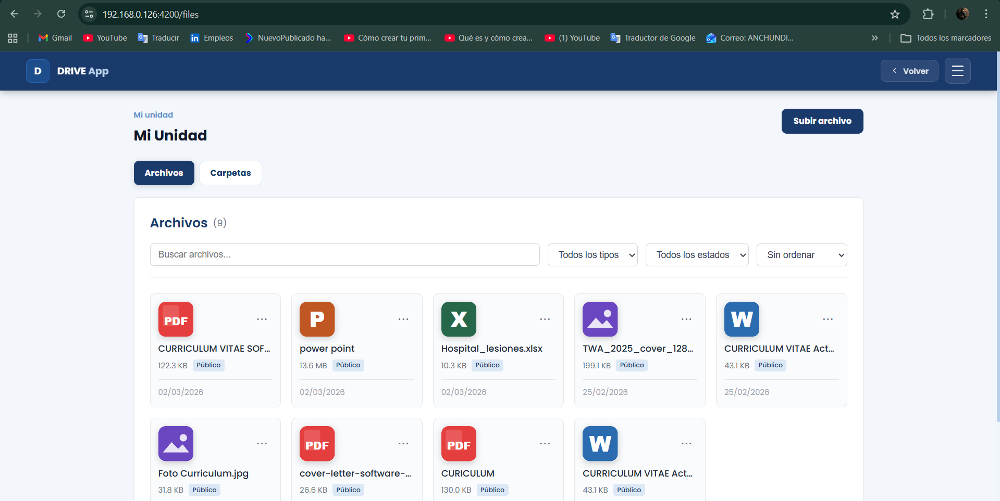
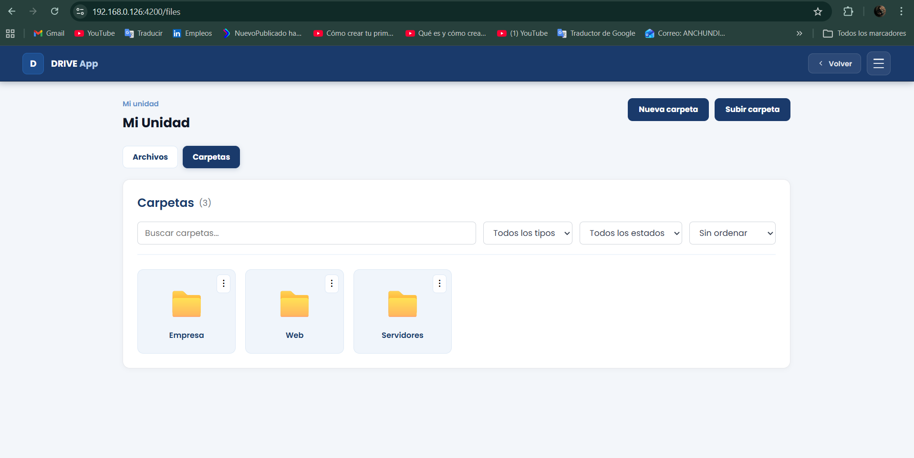
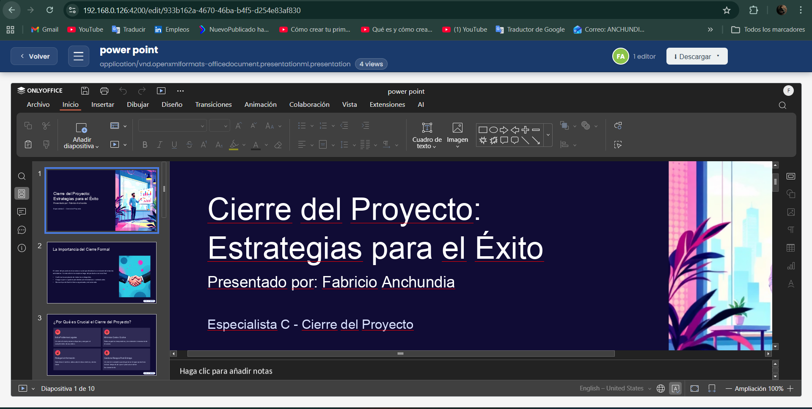
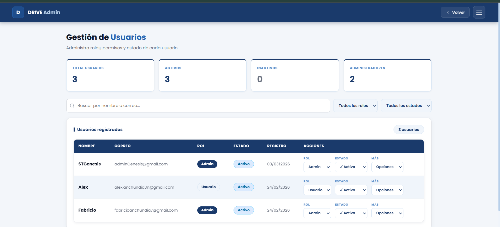
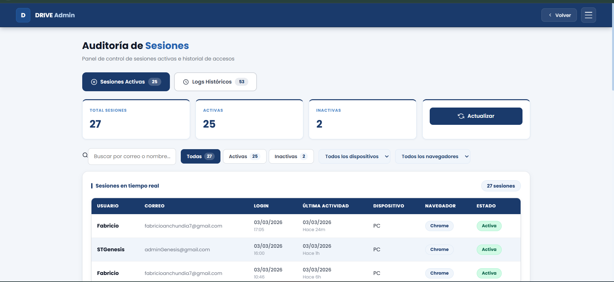

# 📁 Drive App — Enterprise File Management Platform

An enterprise-grade **Google Drive / OneDrive–like platform** for file storage, organization, and real-time collaborative document editing.

Built with **Angular 21, Supabase, and OnlyOffice**, enabling advanced file management, role-based access control, and browser-based document editing.

---

# 🚀 Problem it solves

Many organizations need:

- Full control over their file storage
- Secure file sharing between users
- Real-time document collaboration
- Access auditing and session tracking
- Infrastructure independence

**Drive App** provides a modern enterprise solution for managing files in the cloud while maintaining full platform control.

---

# 🧠 System Architecture

The application uses a modern hybrid architecture:

Frontend SPA  
→ **Angular 21**

Backend service  
→ **Node.js + Express**

Cloud services  
→ **Supabase (Auth + PostgreSQL + Storage)**

Document editing engine  
→ **OnlyOffice Document Server (Docker)**

File delivery  
→ **Cloudinary CDN**

This architecture allows each component to scale independently while maintaining clear separation of responsibilities.

---

# 🔥 Key Features

- 📤 File upload and management
- 📂 Hierarchical folder organization
- 🔍 File search and filtering
- 🤝 File and folder sharing with permissions (viewer / editor)
- 🔗 Public sharing links with secure tokens
- ✏️ Real-time collaborative document editing
- 👤 Administrative control panel
- 📊 Session audit and access monitoring
- 📁 Advanced folder management
- 🔐 Role-based access control

---

# 📸 Screenshots

## 🖥️ Admin Dashboard



The main administrator panel displaying system metrics, quick actions, and shared resources.

---

## 📂 File Manager



Main file management interface with filtering, search, and document previews.

---

## 📁 Folder Management



Hierarchical folder structure used to organize enterprise documents.

---

## ✏️ Collaborative Document Editor (OnlyOffice)



Real-time editing of Word, Excel, and PowerPoint documents directly in the browser.

---

## 👤 User Administration



Administrative panel for managing users, roles, and account status.

---

## 📊 Session Audit



System for monitoring active sessions and historical login records.

---

# 🛠 Technologies Used

## Frontend

- Angular 21
- TypeScript
- Supabase JS SDK
- OnlyOffice API

---

## Backend

- Node.js
- Express
- Supabase Storage
- JSZip

---

## Infrastructure

- Supabase (PostgreSQL + Auth + Storage)
- OnlyOffice Document Server
- Docker
- Cloudinary CDN
- mkcert (local SSL)

---

# ⚙️ Running the Project

From the root folder run:

```bash
START-DRIVE.bat
````

The launcher automatically:

* Detects the local IP address
* Generates a local SSL certificate
* Starts the OnlyOffice Docker container
* Starts the callback server
* Launches the Angular application

---

# 🌐 Application Access

Once started:

```
https://localhost:4200
```

Or from the local network:

```
https://<SERVER-IP>:4200
```

---

# 🔐 User Roles

| Role  | Capabilities                                |
| ----- | ------------------------------------------- |
| user  | Manage personal files and folders           |
| admin | Manage users, sessions, and system settings |

---

# 📦 Project Structure

```
Proyecto-Drive
│
├── README.md
├── START-DRIVE.bat
├── screenshots/
│
├── drive-app/
│   ├── src/
│   ├── angular.json
│   └── tsconfig.json
│
└── onlyoffice-callback/
    ├── server.js
    └── package.json
```

---

# 📌 Project Status

Fully functional enterprise-style file management platform with collaborative document editing and administrative control.

---
# 👨‍💻 Author
- Fabricio Anchundia(Software Engineer)
